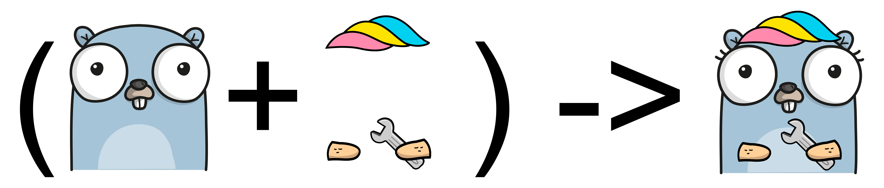

# ✌️ About

**samber/lo** is a Lodash-style utility library for Go that brings the power and convenience of functional programming helpers to the Go ecosystem. Born from the need for more expressive and concise data manipulation, `lo` fills the gaps between Go's standard library and the complex data transformations that modern applications require.



**Why `lo` Exists**

Go's standard library is excellent for many use cases, but it lacks the higher-level abstractions that developers coming from JavaScript, Python, or other languages often miss. While Go 1.18 introduced generics, the standard library's `slices` and `maps` packages only cover about 5-10 basic helpers. `lo` provides hundreds of additional utilities that make everyday programming tasks more enjoyable and less error-prone.

**The name "lo"**

I wanted a short and memorable name, similar to "Lodash". It's easy to type and no existing Go package was using this name, making it unique in the ecosystem.

## 🚀 Install

```go
go get -u github.com/samber/lo@v1
```

This library is v1 and follows SemVer strictly.

No breaking changes will be made to exported APIs before v2.0.0.

This library has no dependencies outside the Go standard library.

## 💡 Usage

You can import lo using:

```go
import (
    "github.com/samber/lo"
    lop "github.com/samber/lo/parallel"
    lom "github.com/samber/lo/mutable"
)
```

Then use one of the helpers below:

```go
names := lo.Uniq([]string{"Samuel", "John", "Samuel"})
// []string{"Samuel", "John"}
```

### Tips for lazy developers

I cannot recommend it, but in case you are too lazy for repeating lo. everywhere, you can import the entire library into the namespace.

```go
import (
    . "github.com/samber/lo"
)
```

I take no responsibility for this junk. 😁 💩

## Community and Evolution

`lo` embraces Go's evolution:
- **Go 1.18**: Leveraged generics for type safety
- **Go 1.23**: Added iterator support with the `it` package
- **Future**: Will continue to adapt to Go's language improvements

The library is actively maintained and welcomes contributions. It follows semantic versioning strictly, ensuring stability for production applications.

## When to Use `lo`

Use `lo` when you need to:
- Transform complex data structures concisely
- Reduce boilerplate code for common operations
- Write more declarative and readable code
- Leverage functional programming patterns in Go
- Process data in parallel or with lazy evaluation

For simple operations, Go's standard library may suffice. But when you find yourself writing nested loops or complex data manipulation logic, `lo` provides the abstractions you need.

## Design Philosophy

### 1. **Type Safety Through Generics**
Every function in `lo` is built on Go 1.18+ generics, ensuring compile-time type safety without sacrificing flexibility. This eliminates runtime type assertions and reduces bugs.

### 2. **Immutable by Default**
The main `lo` package follows functional programming principles by returning new collections rather than modifying existing ones. This predictability makes code easier to reason about and test.

### 3. **Performance When Needed**
For performance-critical scenarios, `lo` offers specialized packages:
- `lo/mutable`: In-place operations that modify collections directly
- `lo/parallel`: Concurrent processing with built-in worker pools
- `lo/it`: Lazy evaluation using Go 1.23+ iterators

### 4. **Minimal Dependencies**
`lo` has zero dependencies outside the Go standard library. This choice ensures reliability, security, and avoids dependency hell.
