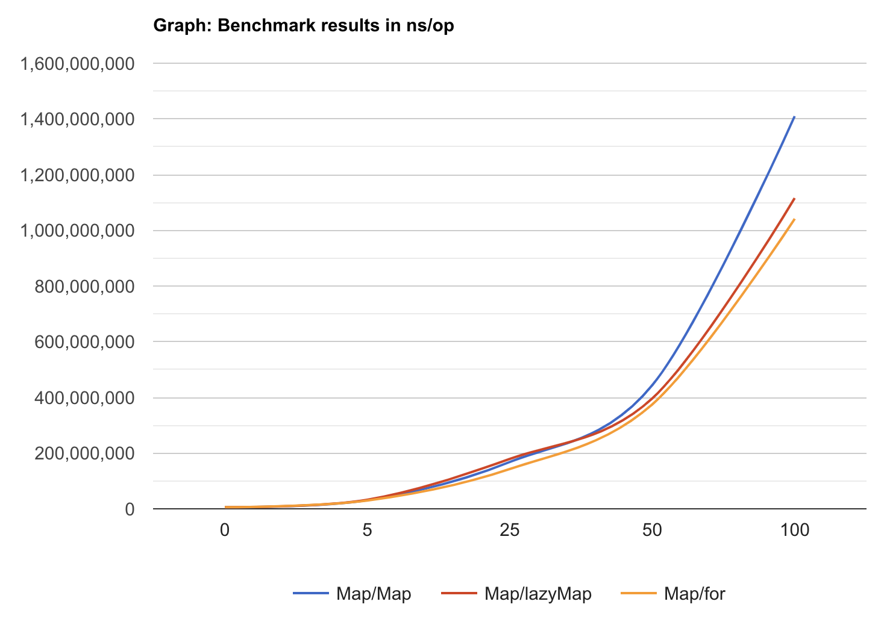
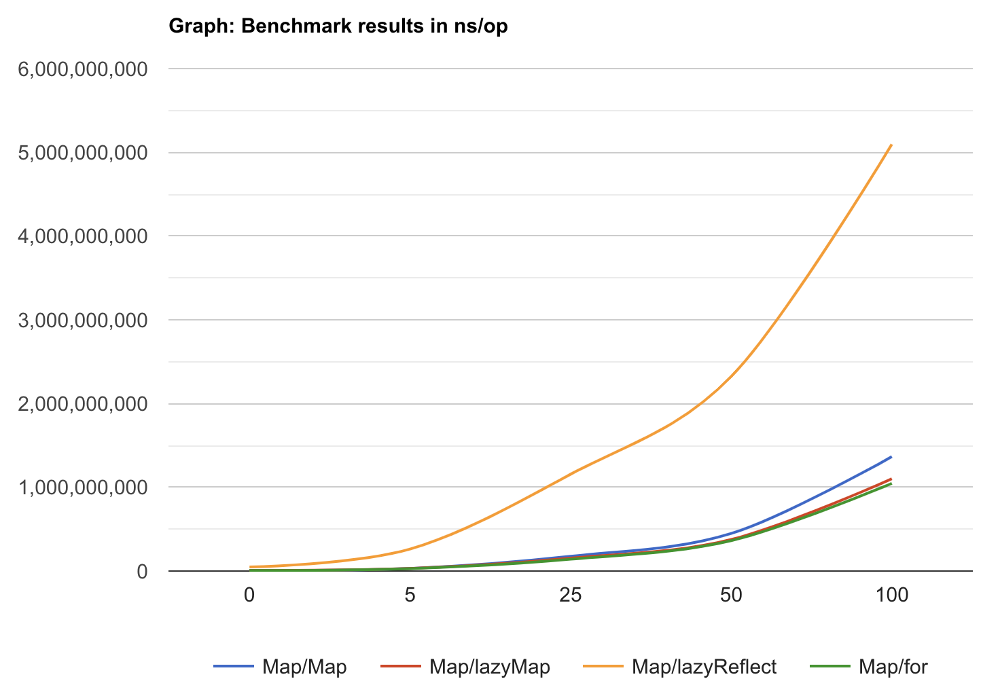

# La as in "lazy."

The main purpose of this package is the usability of iterators for creating pipelines and the ability to express an endless stream of data via iterator. This package proposes useful helpers to work with such streams and the ability to combine actions on them.

In some cases it might be more performant than the original [lo](https://github.com/samber/lo) package, and in other cases it might be not (remember that direct iterations are usually faster than a collection of callbacks produced by iterators. Also, this is subject of change because in future releases of the golang iterators might (or might not) become faster).

You will not find here some helpers that you might find useful if they require collecting the iterator (like `Backward`, `Sort`, `Shuffle` etc.) because in such cases it would be better to just `slices.Collect` them and use great [lo](https://github.com/samber/lo) package to work with slices. Some helpers that require iterator to be collected are presented here by the way. They marked with notice about possible performance drawbacks and related to own category. Be careful while use them!

Also, there is helpers that contain internal state (like [Uniq](#uniq)* family functions), they also marked with notice about their behavior, and you should pay special attention when you use them.

## Spec

**Convert helpers**

Helpers which are useful when you want to change an iterator representation.
- [CollectMap](#collectmap)
- [CollectToMap](#collecttomap)
- [Collect](#collect)
- [CollectTo](#collectto)
- [Seq2ToSeq](#seq2toseq)
- [Entries](#entries)
- [FromEntries](#fromentries)
- [Pairs](#pairs)
- [FromPairs](#frompairs)
- [Tuples](#tuples)
- [FromTuples](#fromtuples)
- [KeyBy](#keyby)
- [SeqToSeq2](#seqtoseq2)
- [Associate](#associate)
- [SliceToMap](#slicetomap)

**Key-Value helpers**

Helpers that related to key-value meaning of the `iter.Seq2`.

- [Enumerate](#enumerate)
- [Keys](#keys)
- [UniqKeys](#uniqkeys)
- [Values](#values)
- [UniqValues](#uniqvalues)
- [Invert](#invert)
- [Join2](#join2)
- [Follow](#follow)

**Filter**

Helpers that produce filtered iterators from raw.

- [Filter](#filter)
- [Filter2](#filter2)
- [FilterByKeys](#filterbykeys)
- [FilterByValues](#filterbyvalues)
- [Uniq](#uniq)
- [UniqBy](#uniqby)
- [Reject](#reject)
- [Reject2](#reject2)
- [RejectByKeys](#rejectbykeys)
- [RejectByValues](#rejectbyvalues)
- [Replace](#replace)
- [Replace2](#replace2)
- [ReplaceAll](#replaceall)
- [ReplaceAll2](#replaceall2)
- [Compact](#compact)
- [Compact2](#compact2)

**Collect**

Helpers that require an iterator to be collected.

Be careful with these functions because if you apply them to an endless iterator, they can hang.

- [Reduce](#reduce)
- [Reduce2](#reduce2)
- [ForEach](#foreach)
- [ForEach2](#foreach2)
- [ForEachWhile](#foreachwhile)
- [ForEachWhile2](#foreachwhile2)
- [KeyValues](#keyvalues)

**Process**

Helpers that allow you to process an iterator.

- [Map](#map)
- [Map2](#map2)
- [MapKeys](#mapkeys)
- [MapValues](#mapvalues)
- [FilterMap](#filtermap)
- [FilterMap2](#filtermap2)
- [FlatMap](#flatmap)
- [FlatMapEnumerated](#flatmapenumerated)
- [Chunk](#chunk)
- [Chunk2](#chunk2)
- [FlattenSlice](#flattenslice)
- [Flatten](#flatten)
- [Interleave](#interleave)
- [Interleave2](#interleave2)
- [RejectMap](#rejectmap)

**Produce**

Helpers that produce an iterator by some criteria.

- [Times](#times)
- [Times2](#times2)
- [Repeat](#repeat)
- [RepeatBy](#repeatby)

# Helpers list
## Convert helpers

### CollectMap
Creates a map from the `iter.Seq2` iterator. Allow you to set the pre-allocated size of the map. If you don't need to do that – prefer to use `maps.Collect`.

```go
mapOut := CollectMap(maps.All(map[string]int{"foo": 1, "bar": 2, "baz": 3}))

fmt.Printf("%v %v %v", mapOut["foo"], mapOut["bar"], mapOut["baz"])
// 1 2 3
```

### CollectToMap
Collect the `iter.Seq2` to already existed map. If some keys from the iter already presented in the map, they will be overwritten. If an iterator returns more than one value for the key – the last one remains.

```go
mapOut := map[string]int{"foo": 3, "bar": 1, "baz": 2, "qux": 4}

mapOut = CollectToMap(
    maps.All(map[string]int{"foo": 1, "bar": 2, "baz": 3}),
    mapOut,
)

fmt.Printf("%v %v %v %v", mapOut["foo"], mapOut["bar"], mapOut["baz"], mapOut["qux"])
// 1 2 3 4
```

### Collect
Creates a slice from the `iter.Seq` iterator. Allow you to set the pre-allocated size of the slice. If you don't need to do that – prefer to use `slices.Collect`.
```go
sl := Collect(
    slices.Values([]int{1, 2, 3, 4, 5}),
    WithSliceCapacity(100),
)

fmt.Printf("%v %v", cap(sl), sl)
// Output: 100 [1 2 3 4 5]
```

### CollectTo
Collect the `iter.Seq` to already existed slice. Values will be appended to the slice.
```go
sl := []int{9, 10}
sl = CollectTo(slices.Values([]int{1, 2, 3, 4, 5}), sl)

fmt.Printf("%v %v", cap(sl), sl)
// 8 [9 10 1 2 3 4 5]
```

### Seq2ToSeq
Transforms an `iter.Seq2` into an `iter.Seq` based on a specific iteratee.
```go
kv := maps.All(map[int]int64{1: 1, 2: 2, 3: 3, 4: 4})

result := Collect(Seq2ToSeq(kv, func(k int, v int64) string {
return fmt.Sprintf("%d_%d", k, v)
}))

slices.Sort(result)

fmt.Printf("%v", result)
// [1_1 2_2 3_3 4_4]
```

### Entries
Creates an iterator of `lo.Entries` from an `iter.Seq2`.
```go
result := Collect(Entries(maps.All(map[string]int{"foo": 1, "bar": 2, "baz": 3})))

sort.Slice(result, func(i, j int) bool {
    return strings.Compare(result[i].Key, result[j].Key) < 0
})
fmt.Printf("%v", result)
// [{bar 2} {baz 3} {foo 1}]
```

### FromEntries
Transforms an `iter.Seq` of key/value pairs into an `iter.Seq2`.
```go
result := CollectMap(FromEntries(slices.Values([]lo.Entry[string, int]{
    {Key:   "foo", Value: 1},
    {Key:   "bar", Value: 2},
    {Key:   "baz", Value: 3},
})))

fmt.Printf("%v %v %v %v", len(result), result["foo"], result["bar"], result["baz"])
// 3 1 2 3
```

### Pairs
Alias of [Entries](#entries)
### FromPairs
Alias of [FromEntries](#fromentries)

### Tuples
Transform an `iter.Seq2` into an `iter.Seq` of `lo.Tuple2`.
```go
result := Collect(Tuples(maps.All(
    map[string]int{"foo": 1, "bar": 2, "baz": 3},
)))

sort.Slice(result, func(i, j int) bool {
    return strings.Compare(result[i].A, result[j].A) < 0
})

fmt.Printf("%v", result)
// [{bar 2} {baz 3} {foo 1}]
```

### FromTuples
Creates an iterator from a slice of `lo.Tuple2`. The `A` field will be treated as a key and the `B` as a value.

```go
keys, values := KeyValues(FromTuples([]lo.Tuple2[string, int]{
    {"foo", 1}, {"bar", 2}, {"baz", 3},
}))

sortedKeys := Collect(keys)
sortedValues := Collect(values)

slices.Sort(sortedKeys)
slices.Sort(sortedValues)

fmt.Printf("%v %v", sortedKeys, sortedValues)
// [bar baz foo] [1 2 3]
```

### KeyBy
Transforms an `iter.Seq` to an `iter.Seq2` based on a pivot callback.

```go
list := slices.Values([]string{"a", "aa", "aaa"})

	result := CollectMap(KeyBy(list, func(str string) int {
		return len(str)
	}))

	fmt.Printf("%v", result)
	// Output: map[1:a 2:aa 3:aaa]
```

### SeqToSeq2
Alias to [KeyBy](#keyby)

### Associate
Associate returns an `iter.Seq2` containing key-value pairs provided by the transform function applied to elements of the given `iter.Seq`.

If any of two pairs have the same key, all of them will be returned in `iter.Seq2` because `iter.Seq2` can contain the same key more than once.

The order of iteration will be the same as in the original `iter.Seq`.

```go
list := slices.Values([]string{"a", "aa", "aaa"})

	result := CollectMap(Associate(list, func(str string) (string, int) {
		return str, len(str)
	}))

	fmt.Printf("%v", result)
	// Output: map[a:1 aa:2 aaa:3]
```

### SliceToMap
Alias to [Associate](#slicetomap)

## Key-Value helpers

### Enumerate
Enumerates an `iter.Seq` to get an `iter.Seq2` that yields index and values.
```go
keys, values := KeyValues(Enumerate(slices.Values([]int{1, 2, 3, 4, 5})))

fmt.Printf("%v %v", Collect(keys), Collect(values))
// [0 1 2 3 4] [1 2 3 4 5]
```
### Keys
Creates an `iter.Seq` of the iter keys.

**Notice:** you should pay attention to keys semantic which differs from the original `lo. Keys` function from the [lo](https://github.com/samber/lo) package. The original one guarantees that keys will be unique across at least one map that passed here. An `iter.Seq2` object doesn't have such a semantic and can contain one key multiple times regardless of the number of passed objects.
```go
kv := maps.All(map[string]int{"foo": 1, "bar": 2})
kv2 := maps.All(map[string]int{"baz": 3})

result := Collect(Keys(kv, kv2))
sort.Strings(result)
fmt.Printf("%v", result)
// [bar baz foo]
```

### UniqKeys
Creates an `iter.Seq` of unique keys in the `iter.Seq2`.

**Notice:** since `iter.Seq2` doesn't guarantee uniqueness of the keys that it yields, you might want to use this function instead of the `Keys` in many cases. Also, be careful here because if you pass an endless iterator, you can create a huge state which tracks keys for uniqueness.
```go
kv := maps.All(map[string]int{"foo": 1, "bar": 2})
kv2 := maps.All(map[string]int{"bar": 3})

result := Collect(UniqKeys(kv, kv2))
sort.Strings(result)
fmt.Printf("%v", result)
// [bar foo]
```
### Values
Creates an `iter.Seq` of an `iter.Seq` values.

Notice: returned values might have the same keys because `iter.Seq2` doesn't require keys to be uniq here.
```go
kv := maps.All(map[string]int{"foo": 1, "bar": 2})
kv2 := maps.All(map[string]int{"baz": 3})

result := Collect(Values(kv, kv2))

sort.Ints(result)
fmt.Printf("%v", result)
// [1 2 3]
```
### UniqValues
Creates an `iter.Seq` of unique values in the `iter.Seq2`.

Be careful here because if you pass an endless iterator, you can create a huge state which tracks values for uniqueness.
```go
kv := maps.All(map[string]int{"foo": 1, "bar": 2})
kv2 := maps.All(map[string]int{"baz": 2})

result := Collect(UniqValues(kv, kv2))

sort.Ints(result)
fmt.Printf("%v", result)
// [1 2]
```

### Invert
Creates an `iter.Seq2` composed of the inverted keys and values.

Notice: duplicate handling semantic differs from the `Invert` function from the [lo](https://github.com/samber/lo) package. An `iter.Seq2` can contain duplicates, and they will remain after inversion.
```go
kv := maps.All(map[string]int{"foo": 1, "bar": 2, "baz": 3})

result := CollectMap(Invert(kv))

fmt.Printf("%v %v %v %v", len(result), result[1], result[2], result[3])
// 3 foo bar baz
```
### Join2
Merges multiple `iter.Seq2` from left to right.

Notice: resulting `iter.Seq2` will contain all key-value pairs regardless of their uniqueness because in contrast with the map type, the `iter.Seq2` can contain many identical keys.

Pay special attention to enumerated `iter.Seq2` (this one which you receive from the `Enumerate` function or something similar to them when you have an integer value as a key). You may mistakenly expect that their indexes will be added to each other, but actually this is not true, and you receive the same index multiple times. To get this behavior, use the [Follow](#follow) function instead.

```go
it := Join2(
    maps.All(map[string]int{"a": 1, "b": 2}),
    maps.All(map[string]int{"b": 3, "c": 4}),
)

resultMap := CollectMap(it)
resultTuples := slices.Collect(Tuples(it))

fmt.Printf("%v %v %v %v %v", len(resultMap), resultMap["a"], resultMap["b"], resultMap["c"], resultTuples)
// 3 1 3 4 [{a 1} {b 2} {b 3} {c 4}]
```
### Follow
Merges multiple enumerated `iter.Seq2` with int keys (like the result of the Enumerate function) and re-enumerate them at the same time.

In contrast to the [Join2](#join2) the [Follow](#follow) will ignore the original index value from the iter and instead provide an ascending index like if you concatenate the values of each `iter.Seq2` and then call the [Enumerate](#enumerate) on the result.

```go
v1, v2 := Enumerate(slices.Values([]int{1, 2, 3})), Enumerate(slices.Values([]int{6, 7, 8}))

res := Follow(v1, v2)

ks, vs := lo.Unzip2(Collect(Tuples(res)))

fmt.Printf("%v %v", ks, vs)
// [0 1 2 3 4 5] [1 2 3 6 7 8]
```

## Filter helpers

### Filter
Iterates over elements of an `iter.Seq`, returning an `iter.Seq`, which yields only values where the predicate returns true.
```go
result := slices.Collect(Filter(slices.Values([]int64{1, 2, 3, 4}), func(nbr int64) bool {
    return nbr%2 == 0
}))

fmt.Printf("%v", result)
// [2 4]
```

### Filter2
Returns the same `iter.Seq2` type filtered by the given predicate.

```go
result := CollectMap(Filter2(maps.All(map[string]int{"foo": 1, "bar": 2, "baz": 3}), func(key string, value int) bool {
    return value%2 == 1
}))

fmt.Printf("%v %v %v", len(result), result["foo"], result["baz"])
// 2 1 3
```
### FilterByKeys
Returns the same `iter.Seq2` type filtered by given keys.

Notice: semantic here differs from the `PickByKeys` function from the [lo](https://github.com/samber/lo) package because in the map you can effectively iterate over keys and pick only those that are requested, but with the `iter.Seq2` this is not possible, and we should iterate over elements and throw away those who don't match.

```go
result := CollectMap(FilterByKeys(maps.All(map[string]int{"foo": 1, "bar": 2, "baz": 3}), []string{"foo", "baz"}))

fmt.Printf("%v %v %v", len(result), result["foo"], result["baz"])
// 2 1 3
```

### FilterByValues
Returns the same `iter.Seq2` type filtered by given values.

```go
result := CollectMap(FilterByValues(maps.All(map[string]int{"foo": 1, "bar": 2, "baz": 3}), []int{1, 3}))

fmt.Printf("%v %v %v", len(result), result["foo"], result["baz"])
// 2 1 3
```

### Uniq
Returns a duplicate-free version of an `iter.Seq`, in which only the first occurrence of each element is kept. The order of result values is determined by the order they occur in the `iter.Seq`.

Be careful here because if you pass an endless iterator, you can create a huge state which tracks values for uniqueness.
```go
list := slices.Values([]int{1, 2, 2, 1})

result := Collect(Uniq(list))

fmt.Printf("%v", result)
// [1 2]
```

### UniqBy
Returns a duplicate-free version of an `iter.Seq`, in which only the first occurrence of each element is kept. The order of result values is determined by the order they occur in the `iter.Seq`. It accepts `iteratee` which is invoked for each element in `iter.Seq` to generate the criterion by which uniqueness is computed.

Be careful here because if you pass an endless iterator, you can create a huge state which tracks values for uniqueness.
```go
list := slices.Values([]int{0, 1, 2, 3, 4, 5})

result := Collect(UniqBy(list, func(i int) int {
    return i % 3
}))

fmt.Printf("%v", result)
// [0 1 2]
```

### Reject
Is the opposite of the [Filter](#filter), this method returns the elements of the `iter.Seq` that predicate doesn't return truth for.

```go
list := slices.Values([]int{0, 1, 2, 3, 4, 5})

	result := Collect(Reject(list, func(x int) bool {
		return x%2 == 0
	}))

	fmt.Printf("%v", result)
	// Output: [1 3 5]
```

### Reject2
Is the opposite of [Filter2](#filter2), this method returns the elements of the `iter.Seq` that predicate doesn't return truth for.

```go
kv := maps.All(map[string]int{"foo": 1, "bar": 2, "baz": 3})

	result := CollectMap(Reject2(kv, func(key string, value int) bool {
		return value%2 == 1
	}))

	fmt.Printf("%v", result)
	// Output: map[bar:2]
```

### RejectByKeys
Returns the same `iter.Seq2` type filtered by given keys.

Notice: semantic here differs from the `OmitByKeys` from the [lo](https://github.com/samber/lo) package because in the map you can effectively iterate over keys and drop those which should be omitted, but with the `iter.Seq2` this is not possible, and we should iterate over elements and throw away those who don't match.

```go
kv := maps.All(map[string]int{"foo": 1, "bar": 2, "baz": 3})

	result := CollectMap(RejectByKeys(kv, []string{"foo", "baz"}))

	fmt.Printf("%v", result)
	// Output: map[bar:2]
```

### RejectByValues
Returns the same `iter.Seq2` type filtered by given values.

Notice: semantic here differs from the `OmitByValues` from the [lo](https://github.com/samber/lo) package because in the map you can effectively iterate over values and drop those which should be omitted, but with the `iter.Seq2` this is not possible, and we should iterate over elements and throw away those who don't match.

```go
kv := maps.All(map[string]int{"foo": 1, "bar": 2, "baz": 3})

	result := CollectMap(RejectByValues(kv, []int{1, 3}))

	fmt.Printf("%v", result)
	// Output: map[bar:2]
```

### Replace
Returns an `iter.Seq` with the first n non-overlapping instances of the `old` replaced by the `new`.

If `n` is less than 0, then all elements will be replaced.

```go
list := slices.Values([]int{0, 1, 0, 1, 2, 3, 0})

	result := Collect(Replace(list, 0, 42, 1))
	fmt.Printf("%v\n", result)

	result = Collect(Replace(list, -1, 42, 1))
	fmt.Printf("%v\n", result)

	result = Collect(Replace(list, 0, 42, 2))
	fmt.Printf("%v\n", result)

	result = Collect(Replace(list, 0, 42, -1))
	fmt.Printf("%v\n", result)

	// Output:
	// [42 1 0 1 2 3 0]
	// [0 1 0 1 2 3 0]
	// [42 1 42 1 2 3 0]
	// [42 1 42 1 2 3 42]
```

### Replace2
Return an `iter.Seq2` with the first n non-overlapping instances of the `old` values replaced by the `new`. The keys remain the same.

If `n` is less than 0, then all elements will be replaced.

```go
list := Enumerate(slices.Values([]int{0, 1, 0, 1, 2, 3, 0}))

	keys, values := KeyValues(Replace2(list, 0, 42, 1))
	fmt.Printf("%v %v\n", Collect(keys), Collect(values))

	keys, values = KeyValues(Replace2(list, -1, 42, 1))
	fmt.Printf("%v %v\n", Collect(keys), Collect(values))

	keys, values = KeyValues(Replace2(list, 0, 42, 2))
	fmt.Printf("%v %v\n", Collect(keys), Collect(values))

	keys, values = KeyValues(Replace2(list, 0, 42, -1))
	fmt.Printf("%v %v\n", Collect(keys), Collect(values))

	// Output:
	// [0 1 2 3 4 5 6] [42 1 0 1 2 3 0]
	// [0 1 2 3 4 5 6] [0 1 0 1 2 3 0]
	// [0 1 2 3 4 5 6] [42 1 42 1 2 3 0]
	// [0 1 2 3 4 5 6] [42 1 42 1 2 3 42]
```

### ReplaceAll
Shortcut for [Replace](#replace) with n equal to -1.

### ReplaceAll2
Shortcut for [Replace2](#replace2) with n equal to -1.

### Compact
Returns an `iter.Seq` of all non-zero elements.

```go
list := slices.Values([]string{"", "foo", "", "bar", ""})

	result := Collect(Compact(list))

	fmt.Printf("%v", result)

	// Output: [foo bar]
```

### Compact2
Returns an `iter.Seq2` of all non-zero elements.

```go
list := Enumerate(slices.Values([]string{"", "foo", "", "bar", ""}))

	keys, values := KeyValues(Compact2(list))

	fmt.Printf("%v %v", Collect(keys), Collect(values))

	// Output: [1 3] [foo bar]
}
```
## Collect helpers
### Reduce
Reduces an `iter.Seq` to a value which is the accumulated result of running each element in the `iter.Seq` through accumulator, where each successive invocation is supplied with the return value of the previous.

Since this function requires collecting all values from the iterator – in many cases, it will be better to use the `Reduce` from the [lo](https://github.com/samber/lo) package after `slices.Collect` on the iterator instead of this function.

```go
result := Reduce(slices.Values([]int64{1, 2, 3, 4}), func(agg int64, item int64) int64 {
    return agg + item
}, 0)

fmt.Printf("%v", result)
// 10
```
### Reduce2
Reduces an `iter.Seq2` to a value which is the accumulated result of running each element in the `iter.Seq2` through accumulator, where each successive invocation is supplied with the return value of the previous.

Since this function requires collecting all values from the iterator – in many cases, it will be better to use the `Reduce` from the [lo](https://github.com/samber/lo) package after [Tuples](#tuples) and `slices.Collect` on the iterator instead of this function.

```go
result := Reduce2(Enumerate(slices.Values([]int64{1, 2, 3, 4})), func(agg int64, k int, item int64) int64 {
    if k%2 == 0 {
        return agg + item
    }

    return agg
}, 0)

fmt.Printf("%v", result)
// 4
```
### ForEach
Iterates over elements of an `iter.Seq` and invokes iteratee for each element.

```go
ForEach(slices.Values([]int64{1, 2, 3, 4}), func(x int64) {
    fmt.Println(x)
})

// 1
// 2
// 3
// 4
```

### ForEach2
Iterates over elements of an `iter.Seq2` and invokes iteratee for each element.

```go
ForEach2(Enumerate(slices.Values([]int64{1, 2, 3, 4})), func(k int, x int64) {
    fmt.Printf("%d %d\n", k, x)
})

// 0 1
// 1 2
// 2 3
// 3 4
```

### ForEachWhile
Iterates over elements of an `iter.Seq` and invokes iteratee for each element, the returned value decides to continue or break, like do while().

```go
ForEachWhile(slices.Values([]int64{1, 2, -math.MaxInt, 4}), func(x int64) bool {
    if x < 0 {
        return false
    }
    fmt.Println(x)
    return true
})

// 1
// 2
```

### ForEachWhile2
Iterates over elements of an `iter.Seq` and invokes iteratee for each element, the returned value decides to continue or break, like do while().

```go
ForEachWhile2(Enumerate(slices.Values([]int64{1, 2, -math.MaxInt, 4})), func(k int, x int64) bool {
    if x < 0 {
        return false
    }
    fmt.Printf("%d %d\n", k, x)
    return true
})

// 0 1
// 1 2
```

### KeyValues
Creates two parallel iterators where the first yields keys and the second – values of the original iterator.

To achieve that, it is necessary to walk through an original iterator twice, so if your iterator is not support that – avoid this function.
```go
kv := FromTuples([]lo.Tuple2[string, int]{
    {"foo", 1},
    {"bar", 2},
    {"baz", 3},
})

keys, values := KeyValues(kv)

fmt.Printf("%v %v", Collect(keys), Collect(values))
// [foo bar baz] [1 2 3]
```

## Process helpers

### Map
Manipulates an `iter.Seq` and transforms it to an `iter.Seq` of another type.

```go
result := Collect(Map(slices.Values([]int64{1, 2, 3, 4}), func(nbr int64) string {
    return strconv.FormatInt(nbr*2, 10)
}))

fmt.Printf("%v", result)
// [2 4 6 8]
```
### Map2
Manipulates an `iter.Seq2` entries and transforms it to an `iter.Seq2` of another type.

```go
result := CollectMap(Map2(maps.All(map[string]int{"foo": 1, "bar": 2}), func(k string, v int) (int, string) {
    return v, k
}))

fmt.Printf("%v\n", result)
// Output: map[1:foo 2:bar]
```
### MapKeys
Manipulates an `iter.Seq2` keys and transforms it to an `iter.Seq2` of another type.

```go
result := CollectMap(MapKeys(maps.All(map[int]int{1: 1, 2: 2, 3: 3, 4: 4}), func(_ int, k int) string {
    return strconv.FormatInt(int64(k), 10)
}))

fmt.Printf("%v %v %v %v %v", len(result), result["1"], result["2"], result["3"], result["4"])
// Output: 4 1 2 3 4
```

### MapValues
Manipulates an `iter.Seq2` values and transforms it to an `iter.Seq2` of another type.

```go
result := CollectMap(MapValues(maps.All(map[int]int{1: 1, 2: 2, 3: 3, 4: 4}), func(v int, _ int) string {
    return strconv.FormatInt(int64(v), 10)
}))

fmt.Printf("%v %q %q %q %q", len(result), result[1], result[2], result[3], result[4])
// 4 "1" "2" "3" "4"
```

### FilterMap
Returns an `iter.Seq`, which obtained after both filtering and mapping using the given callback function.

The callback function should return two values:
 - the result of the mapping operation and
 - whether the result element should be included or not.

```go
result := Collect(FilterMap(slices.Values([]int64{1, 2, 3, 4}), func(nbr int64) (string, bool) {
    return strconv.FormatInt(nbr*2, 10), nbr%2 == 0
}))

fmt.Printf("%v", result)
// [4 8]
```
### FilterMap2
Returns an `iter.Seq2`, which obtained after both filtering and mapping using the given callback function.

The callback function should return two values:
 - the result of the mapping operation and
 - whether the result element should be included or not.

```go
result := CollectMap(FilterMap2(maps.All(map[string]int64{"foo": 1, "bar": 2, "baz": 3}), func(k string, nbr int64) (string, bool) {
    return strconv.FormatInt(nbr*2, 10), nbr%2 == 0
}))

fmt.Printf("%v", result)
// map[bar:4]
```

### FlatMap
Manipulates an `iter.Seq` and transforms and flattens it to an `iter.Seq` of another type.

The transform function can either return an `iter.Seq` or `nil`, and in the `nil` case no value is yielded to the final `iter.Seq`.

```go
result := Collect(FlatMap(slices.Values([]int64{1, 2, 3, 4}), func(nbr int64) iter.Seq[string] {
    return slices.Values([]string{
        strconv.FormatInt(nbr, 10), // base 10
        strconv.FormatInt(nbr, 2),  // base 2
    })
}))

fmt.Printf("%v", result)
// [1 1 2 10 3 11 4 100]
```

### FlatMapEnumerated
Manipulates an `iter.Seq2` in the special case – when the key represents an index (like when your `iter.Seq2` was produced by the [Enumerate](#enumerate) function). This function transforms and flattens it to an `iter.Seq2` of another type and re-enumerates with proper indexes. All the original indexes will be ignored.

The transform function can either return an `iter.Seq2` or `nil`, and in the `nil` case no value is yielded to the final `iter.Seq2`.

```go
keys, values := KeyValues(FlatMapEnumerated(Enumerate(slices.Values([]int64{1, 2, 3, 4})), func(_ int, nbr int64) iter.Seq[string] {
    return slices.Values([]string{
        strconv.FormatInt(nbr, 10), // base 10
        strconv.FormatInt(nbr, 2),  // base 2
    })
}))

fmt.Printf("%v-%v", Collect(keys), Collect(values))
// [0 1 2 3 4 5 6 7]-[1 1 2 10 3 11 4 100]
```

### Chunk
Returns an `iter.Seq` of elements split into slices the length of size. If `iter.Seq` can't be split evenly, the final chunk will be the remaining elements.

Iterator will be collected lazily, not more than one chunk at once. Also, internally will be allocated chunk-sized slice to store temporary items collected from the chunk.
```go
list := slices.Values([]int{0, 1, 2, 3, 4})

result := Chunk(list, 2)

for item := range result {
    fmt.Printf("%v\n", item)
}
// [0 1]
// [2 3]
// [4]
```

### Chunk2
Returns an `iter.Seq` of elements split into `iter.Seq2` the length of the `size`. If `iter.Seq2` can't be split evenly, the final chunk will be the remaining elements.

Iterator will be collected lazily, not more than one chunk at once. Also, internally will be allocated chunk-sized slice to store temporary items collected from the chunk.
```go
list := Enumerate(slices.Values([]int{4, 3, 2, 3, 4}))

	result := Chunk2(list, 2)

	for item := range result {
		keys, values := KeyValues(item)

		fmt.Printf("%v %v\n", Collect(keys), Collect(values))
	}
	// Output:
	// [0 1] [4 3]
	// [2 3] [2 3]
	// [4] [4]
```

### Flatten
Returns an `iter.Seq` a single level deep.

```go
list := slices.Values([]iter.Seq[int]{slices.Values([]int{0, 1, 2}), slices.Values([]int{3, 4, 5})})

	result := Flatten(list)

	fmt.Printf("%v", Collect(result))
	// Output: [0 1 2 3 4 5]
```

### FlattenSlice
Returns an `iter.Seq` a single level deep.
```go
list := slices.Values([][]int{{0, 1, 2}, {3, 4, 5}})

	result := FlattenSlice(list)

	fmt.Printf("%v", Collect(result))
	// Output: [0 1 2 3 4 5]
```

### Interleave
Round-robin alternating input slice of an `iter.Seq` and sequentially yield them in a result iterator.

```go
list1 := []iter.Seq[int]{
slices.Values([]int{1, 4, 7}),
slices.Values([]int{2, 5, 8}),
slices.Values([]int{3, 6, 9}),
}
list2 := []iter.Seq[int]{
slices.Values([]int{1}),
slices.Values([]int{2, 5, 8}),
slices.Values([]int{3, 6}),
slices.Values([]int{4, 7, 9, 10}),
}

	result1 := Collect(Interleave(list1...))
	result2 := Collect(Interleave(list2...))

	fmt.Printf("%v\n", result1)
	fmt.Printf("%v\n", result2)
	// Output:
	// [1 2 3 4 5 6 7 8 9]
	// [1 2 3 4 5 6 7 8 9 10]
```

### Interleave2
Round-robin alternating input slice of an `iter.Seq2` and sequentially yield them in a result iterator

```go
list1 := []iter.Seq2[int, int]{
Enumerate(slices.Values([]int{1, 4, 7})),
Enumerate(slices.Values([]int{2, 5, 8})),
Enumerate(slices.Values([]int{3, 6, 9})),
}
list2 := []iter.Seq2[int, int]{
Enumerate(slices.Values([]int{1})),
Enumerate(slices.Values([]int{2, 5, 8})),
Enumerate(slices.Values([]int{3, 6})),
Enumerate(slices.Values([]int{4, 7, 9, 10})),
}

	keys1, values1 := KeyValues(Interleave2(list1...))
	keys2, values2 := KeyValues(Interleave2(list2...))

	fmt.Printf("%v %v\n", Collect(keys1), Collect(values1))
	fmt.Printf("%v %v\n", Collect(keys2), Collect(values2))
	// Output:
	// [0 0 0 1 1 1 2 2 2] [1 2 3 4 5 6 7 8 9]
	// [0 0 0 0 1 1 1 2 2 3] [1 2 3 4 5 6 7 8 9 10]
```

### RejectMap
Is the opposite of [FilterMap](#filtermap), this method returns an `iter.Seq` which obtained after both filtering and mapping using the given callback function.

The callback function should return two values:
- the result of the mapping operation and
- whether the result element should be included or not.


```go
list := slices.Values([]int64{1, 2, 3, 4})

	result := Collect(RejectMap(list, func(nbr int64) (string, bool) {
		return strconv.FormatInt(nbr*2, 10), nbr%2 != 0
	}))

	fmt.Printf("%v", result)
	// Output: [4 8]
```

## Produce helpers

### Times
Invokes the iteratee n-times lazily, returning an `iter.Seq` yields each invocation by request.

Keep in mind that if you re-start iteration of the iterator, you will initiate a new sequence and indexes will be re-started from zero.
```go
result := Collect(Times(3, func(i int) string {
return strconv.FormatInt(int64(i), 10)
}))

fmt.Printf("%v", result)
// [0 1 2]
```

### Times2
Invokes the iteratee func n-times lazily, returning an `iter.Seq2` where the key part will be set to index of invocation and the value is a result of iteratee invocation.

Keep in mind that if you re-start iteration of the iterator, you will initiate a new sequence and indexes will be re-started from zero.
```go
keys, values := KeyValues(Times2(3, func(i int) string {
    return strconv.FormatInt(int64(i), 10)
}))

fmt.Printf("%v %v", Collect(keys), Collect(values))
// [0 1 2] [0 1 2]
```

### Repeat
Builds an `iter.Seq` with N copies of initial value.

```go
result := Collect(Repeat(2, foo{"a"}))

	fmt.Printf("%v", result)
	// Output: [{a} {a}]
```

### RepeatBy
Builds an `iter.Seq` with values returned by N calls of callback.

```go
result := Collect(RepeatBy(5, func(i int) string {
return strconv.FormatInt(int64(math.Pow(float64(i), 2)), 10)
}))

	fmt.Printf("%v", result)
	// Output: [0 1 4 9 16]
```

## Performance

Worth mentioning that regardless the performance is not the **main** purpose here, the package remains pretty performant as well and performance always stays in focus when functions are created.

For main building block – the function `Map` there are benchmarks. You can see the result on my specific machine (lower is better):


Also, there is a comparison with another reflection-based package:


As you can see here: more layers of mapping functions, you have more benefits you can get from the iterators. But even if you have only one or zero layers – it will not be much worse than simple for loop.

All benchmarks are presented in source code and reproducible.
